# krRadar
NTU EEE Final Year Project - Feasibility Study of a Satellite-Based Passive Radar

## Introduction
This project investigates the feasibility of using DVB-T2 terrestrial broadcasts and Starlink satellite beacons as illuminators of opportunity for passive radar in Singapore. Passive radar differs from active radar by not emitting signals; instead, it exploits existing transmissions for detection and tracking.

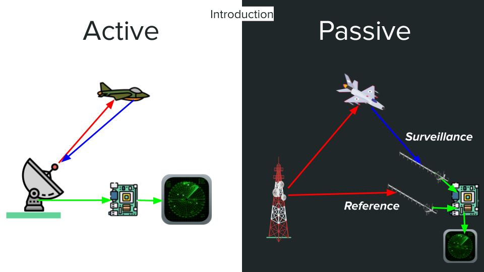

---

## Motivation
- **Historical Context**: Passive radar has been used since WWII (e.g., German exploitation of British radars).
- **Modern Relevance**: Useful for detecting stealth aircraft since lower frequencies resonate better with large aircraft.
- **Research Gap**: DVB-T2-based passive radars are proven in Europe (e.g., LETI, St. Petersburg), but Singapore’s shorter transmitter–receiver baseline (~0.62 km vs ~30 km in Europe) poses challenges due to obstructions and multipath.

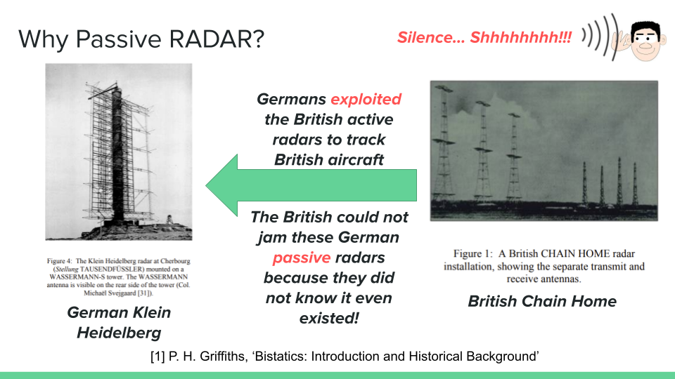
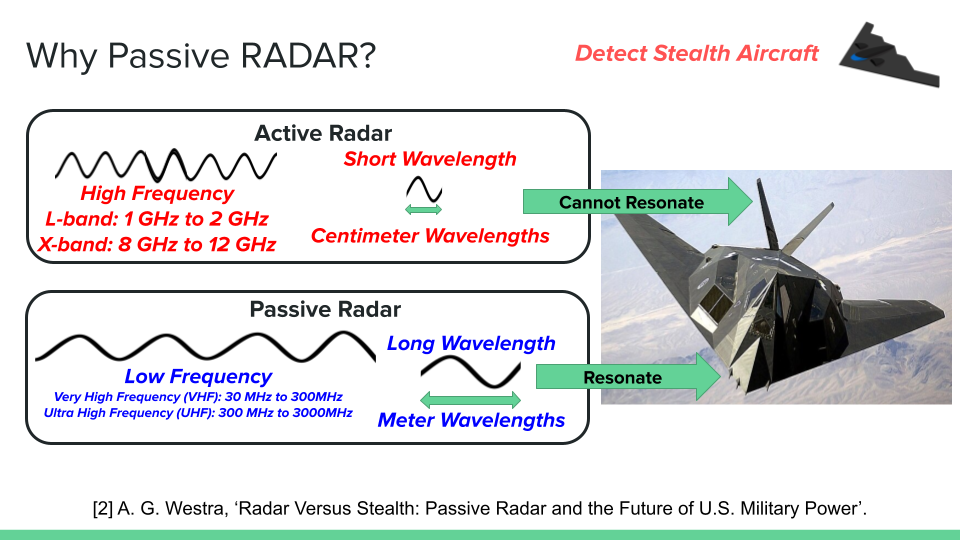

---

## Objectives
Design and evaluate a DVB-T2 based passive radar system capable of:
1. Detecting  
2. Locating  
3. Tracking  
cars, ships, and aircraft in Singapore.

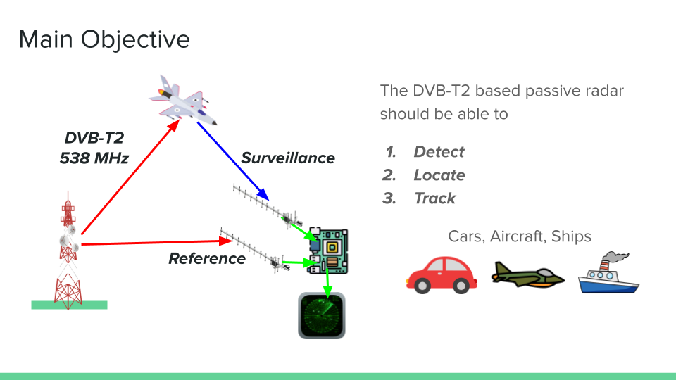

---

## Methodology
### Hardware

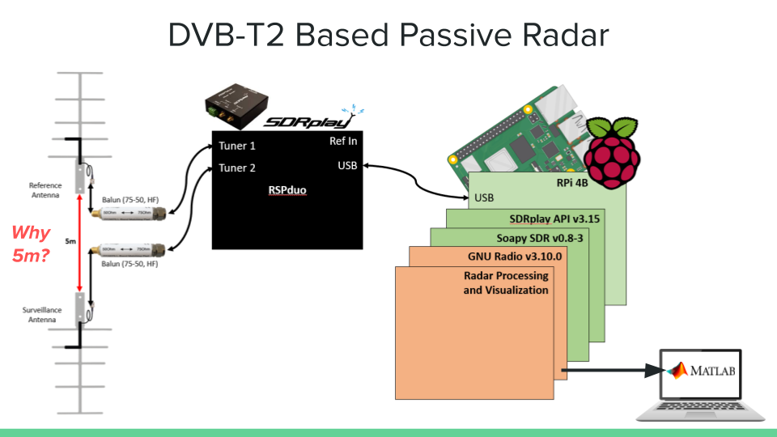

#### Antenna Simulation
- **Antenna**: Log-Periodic Dipole Array (LPDA) simulated and deployed.
- **Setup**: Separate reference and surveillance antennas, 5 m apart, deployed near Changi Airport.

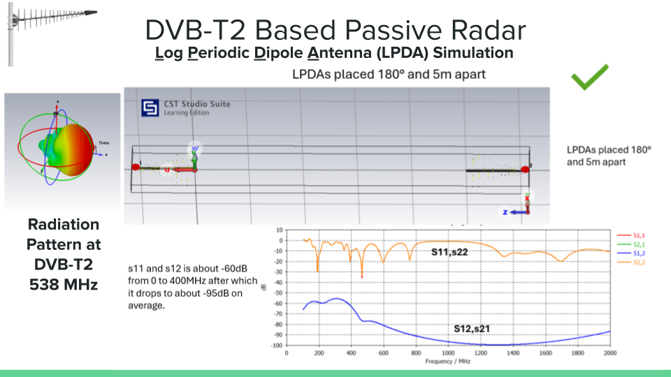

### Software
- **Signal Processing Chain**: Removing Direct Path Interference of Reference in Surveillance, Matched Filtering
- **Implementation**: GNU Radio for real-time processing and MATLAB for post-processing.

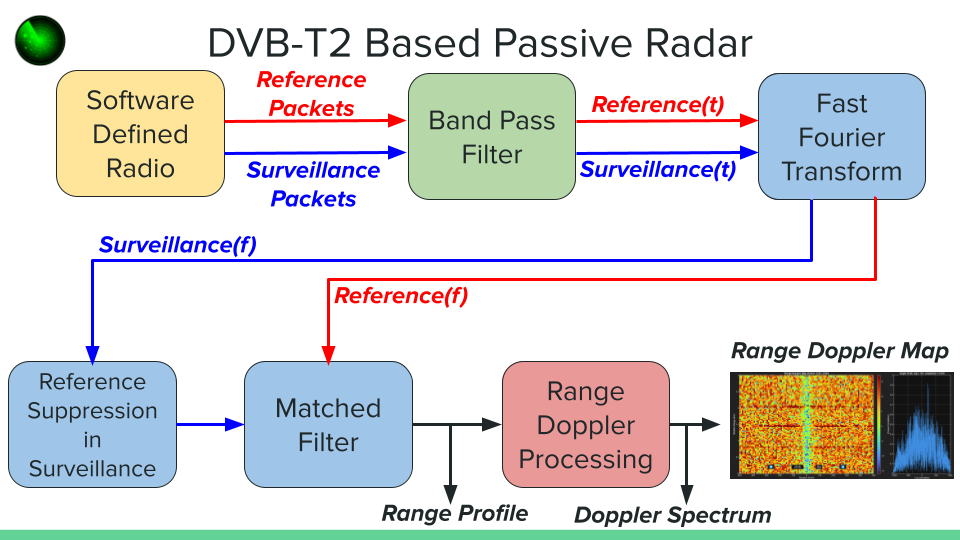

---

## Experiments
- **DVB-T2 Field Tests**: Aircraft approaching Changi Airport were detected using DVB-T2 signals at 538 MHz.
- **Results**: Range-Doppler maps showed moving targets (aircraft). Challenges included:
  - Insufficient antenna height (trees blocking LOS to transmitter)
  - Time synchronization issues (Linux scheduling, phase drift)
  - Multipath from sea reflections reducing SNR

### Field Testing
Here are some pictures of the test setup and field experiments:

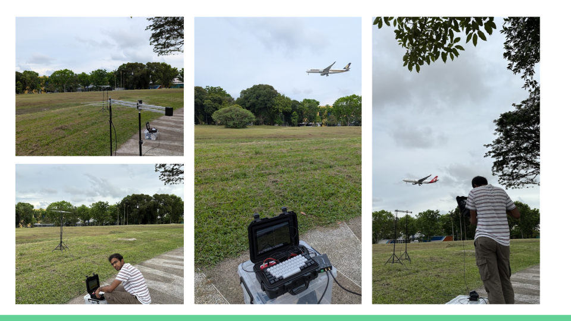  
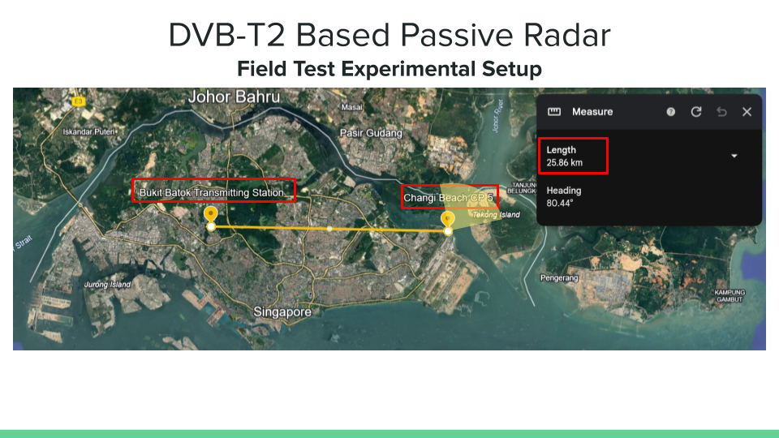
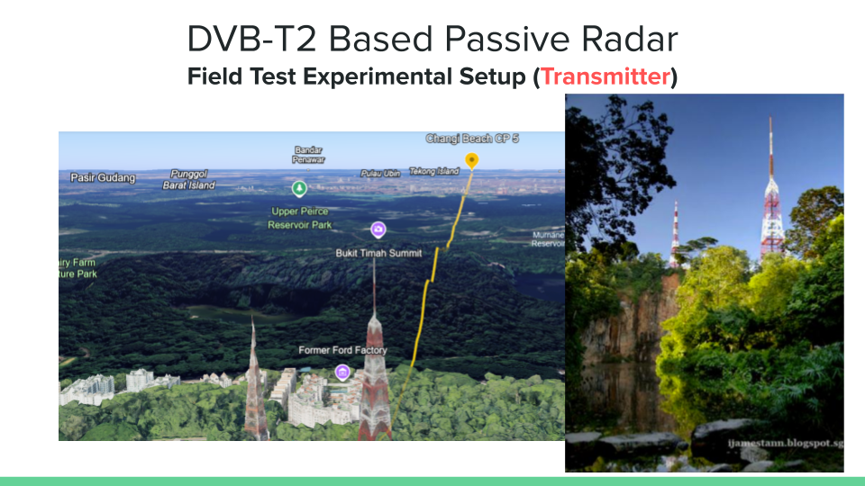  
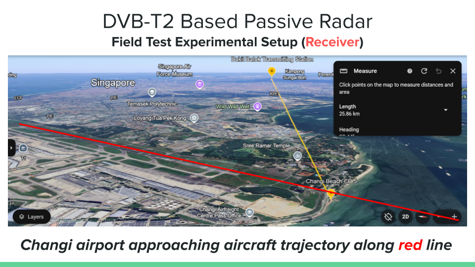  

### Results
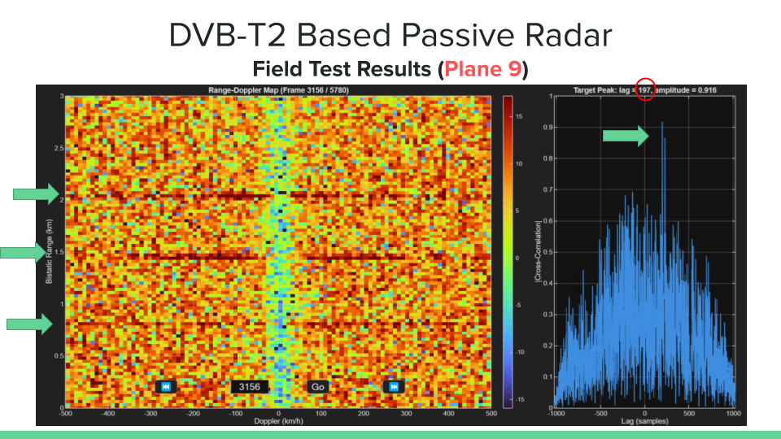  
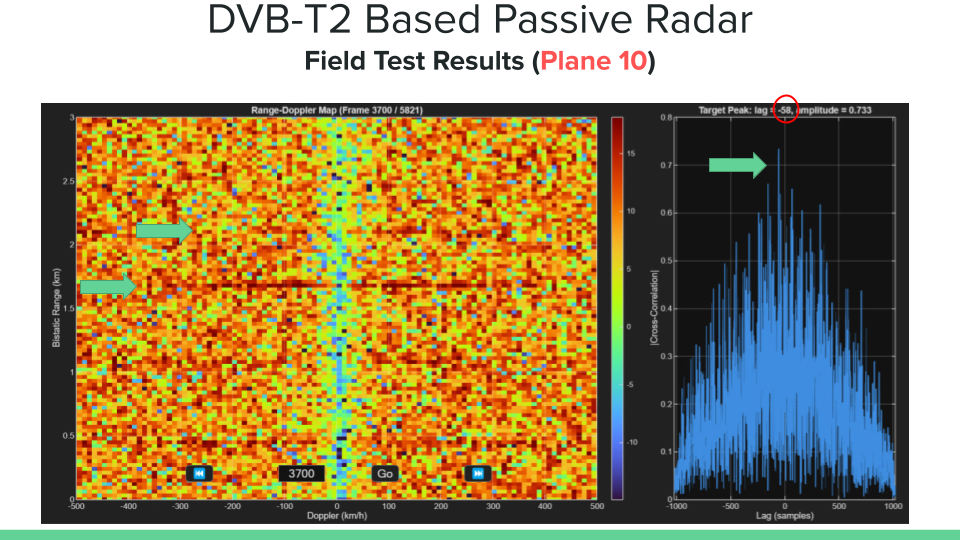

---

## Conclusion
- A DVB-T2-based passive radar works in Singapore despite urban clutter and short transmitter–receiver baselines.  

Future research will focus on improving synchronization, clutter suppression, and satellite-based IO experiments.